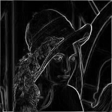

# Edge-Detection
A simple repository to test out basic edge detection techniques in C#. 
It uses SkiaSharp library for image handling (only)

## Dependencies
- .NET SDK v9.0
- SkiaSharp library v3.119.0
- xunit (for testing) v2.9.2

## Installation and setup
1. Install .NET SDK v9.0
   - Download and install the latest .NET SDK from [Microsoft's official site](https://dotnet.microsoft.com/download).
2. Clone the repository
```shell
git clone https://github.com/WoollyAttorney/edge-detection.git
```
3. Navigate to the project directory
```shell
cd edge-detection
```
4. Restore dependencies
```shell
dotnet restore
```
5. Build the project
```shell
dotnet build -c Release
```

## Usage
Run the project
```shell
dotnet run -c Release
```
Follow the prompts to provide an image path and an edge detection operator. The supported operators are: Sobel, and Prewitt.

## Testing
To run tests, use the following command:
```shell
dotnet test -c Release
```

## UML Class Diagram


## Results
Running both operators on the images from resources produces the following results:
| Image Name       | Original Image                                        | Sobel                                                              | Prewitt                                           |
|------------------|-------------------------------------------------------|--------------------------------------------------------------------|--------------------------------------------------|
| Einstein         |       |       |        |
| Lena             |        |        |        |


## TODO
- [ ] Add tests with coverage
- [ ] Add github actions for testing
- [ ] Optimize the convolution algorithm